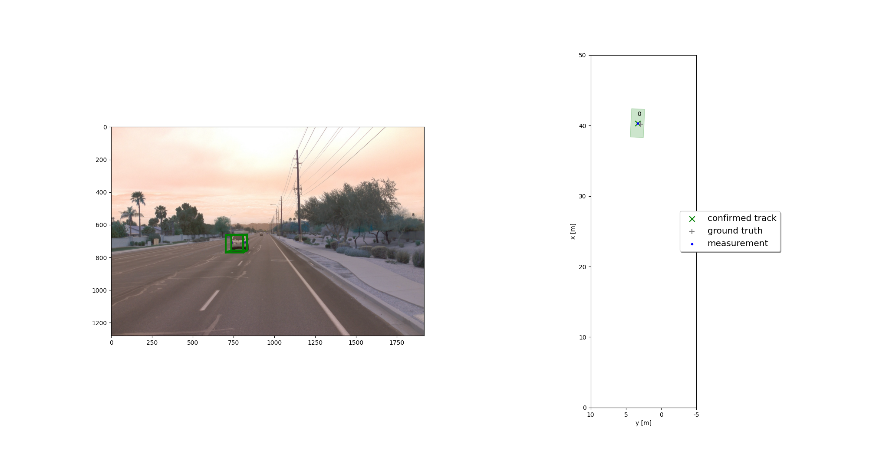
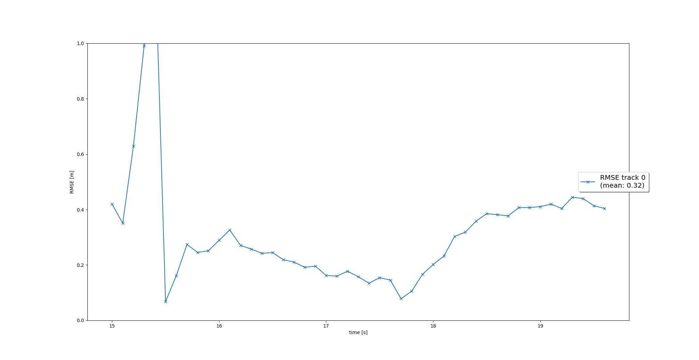
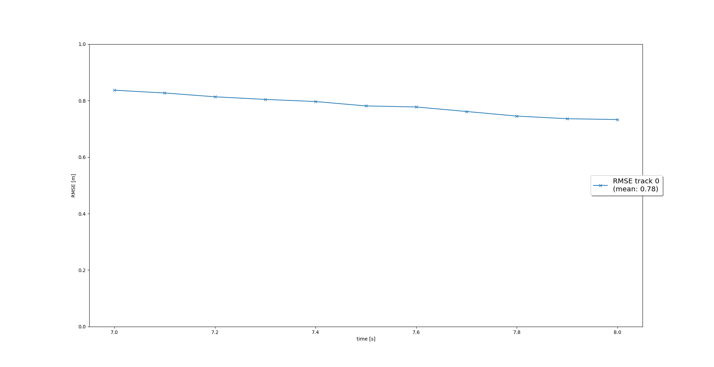
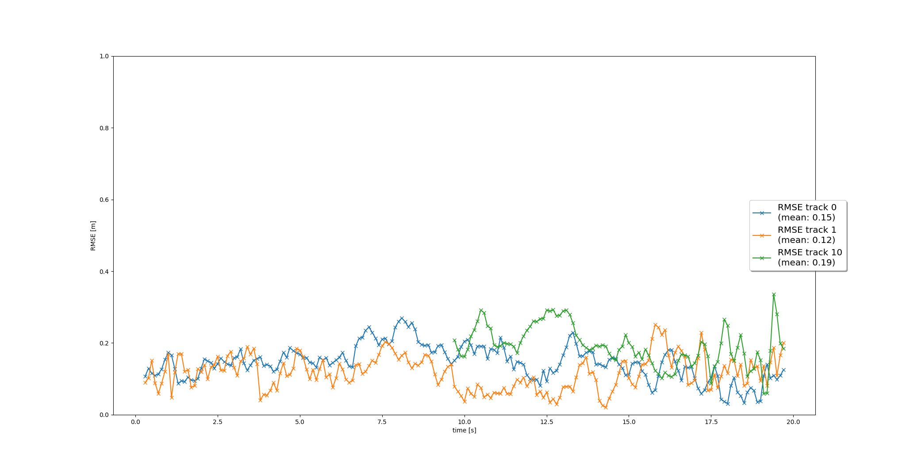
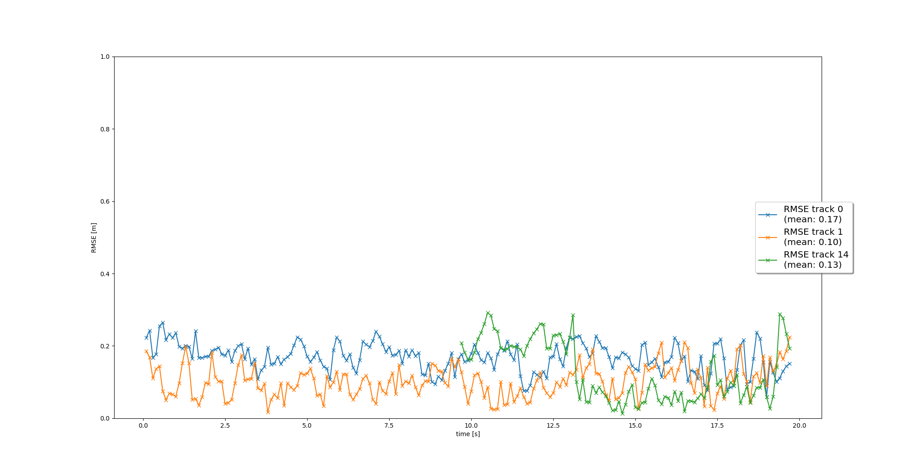

# Writeup: Track 3D-Objects Over Time

### 1. Write a short recap of the four tracking steps and what you implemented there (filter, track management, association, camera fusion). Which results did you achieve? Which part of the project was most difficult for you to complete, and why?

## Filter Step:
In order to complete the Filter class, working predict() and update() functions needed to be created. First, proper Q, F, gamma, and S matrices needed to be written. F was just a linear relation with position and velocity using dt in a 6 by 6 form, while the process noise covariance was calculated through the integral and is a 6 by 6 matrix as well. Gamma was completed using the get_hx() method in order to work for lidar and camera measurements. Then the predict and update used the regular kalman filter equations with the exception of H matrix depending on the sensor type for the measurement. 

A single track based implementation after the first step completion was successful as seen by the RMSE error chart. 

## Track Management Step:
The second step involved implementing the track management part including finishing the Trackmanagement class and Track class. First the 6 by 1 x vector was initialized with the measurement and updated from sensor to vehicle coordinates. Then the estimation error covariance matrix P is initialized using rotation matrix and R for the position variance and the velocity uncertainties for the velocity variance and combined into a 6 by 6 matrix. The state of an initialized track is 'initialized' and the score is set to `1./params.window`. Then the manage track function decreases the track score for unassigned tracks still in the fov of the respective sensor and deletes tracks that are old, track score is too low, or estimation error covariance is too high. Finally, a track that is there and being updated will increase the score by `+=1./params.window` until it reaches `1.0` and becomes tentative if first initialized or becomes confirmed if it was tentative and the track score has reached a threshold.

The single car is internalized, then confirmed and deleted.

## Data Association Step:
A simple nearest neighbor data association for tracks and measurements for subsequent updates is implemented with gating. First, the `associate` function initializes the unassigned tracks and measurements list with the indices of tracks and measurement list and the association matrix is made using the mahalanobis distances if the measurement is within the gating for that track. Next, the `get_closest_track_and_meas` function finds the minimum mhd if it exists and deletes the row and column that it was found in for the association matrix. That track and measurement pair is then returned as the updated track and measurement.

The results show proper multi-target tracking although due to the program so far only using lidar measurements, there are many ghost tracks that are initialized along the frames and even become tentative as well. 

## Camera Sensor Fusion Step:
Finally, the last step involves setting up the camera measurement functions and values along with changing the code to update based on camera measurements as well. The z vector and R matrix are initialized and the get-hx() function uses the direct non-linear transformation from camera coordinates to image coordinates. The in_fov() checks whether an object can be seen in the sensor's field of view.

After implementing the fusion part, the results for the multi-target-tracking are improved. The ghost tracks are more quickly deleted since they don't become tentative due to not being detected by the camera sensor and the position of the actual true postive vehicles is more accurate when using the camera measurements and updates as well.

The most difficult parts of the project to complete was figuring out the extended-kalman-filter implementation and when to use the EKF equations in place of regular KF due to the non-linear camera measurement model. Along with this, the logic for track management, when to increase the score, when to decrease the score, and when to delete a track was a bit complicated to understand at first, but after looking at the different scenarios it became easy to understand.

### 2. Do you see any benefits in camera-lidar fusion compared to lidar-only tracking (in theory and in your concrete results)? 
The concrete results definitely show improvement over lidar-only tracking as mentioned prior and there are theoretical benefits as well. The object detection and classification can be made more robust and accurate when combining the learned model detections of the camera, which is very strong in object classification and detection, with the lidar's range data and position information. With lidar only measurements being used in the early part of the project, there were many ghost tracks being initialized and some even being tentative due to improper association and track score not being decreased. Furthermore, the boxes around the confirmed vehicles were a bit offset when using lidar measurements only. Updating the tracks using camera measurements improved upon both of these issues since the ghost tracks were deleted very quickly, immediately after being initialized, and the localization of the boxes around confirmed vehicles fit more accurately hence decreasing the RMSE. 

### 3. What challenges will a sensor fusion system face in real-life scenarios? Did you see any of these challenges in the project?
In real-life, one challenge could be unbalanced updates based on sensor type. For example, the update or measurement rate of one of the sensor types could be much faster than the other, so either the updates happen as the data is collected and processed real time or the model can choose to wait until the other sensor is finished with one time step(varying time steps for different sensor types). In the project, the timestep is assumed to be the same for both sensor types and lidar measurements are updated first for tracks then camera. Another challenge would be to transform the coordinates of the sensors' detections to the proper vehicle coordinate system in the case of multiple of each type of sensor. In this project, only one lidar and camera each for the front were modeled. Another challenge could also be one sensor type may be more robust and reliable in certain environmental conditions than the other, like certain weather conditions or against non-reflective objects. In the project, the input data images from visualization seemed to reflect decently optimal weather and vehicle reflectivity. Finally, this project assumed a linear motion model, but in reality surrounding objects don't have to behave in a linear fashion.

### 4. Can you think of ways to improve your tracking results in the future?
Some ways to improve the tracking results could be to use a more complex or involved motion model for the kalman filter equations to reflect more diverse span of real world scenarios. Another way to improve the error in tracking could be to implement a more complex data association model. Also, the constant parameters used throughout the functions can be tuned to improve results as well. 

