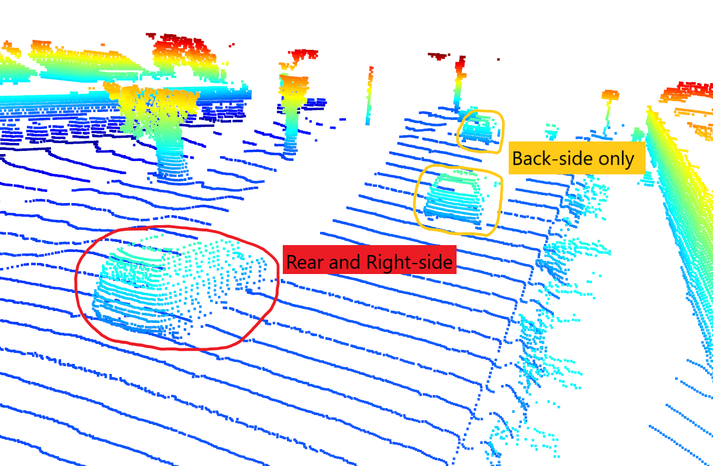
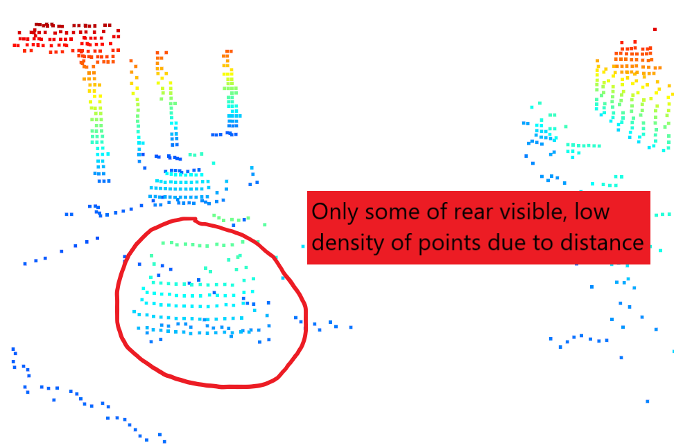
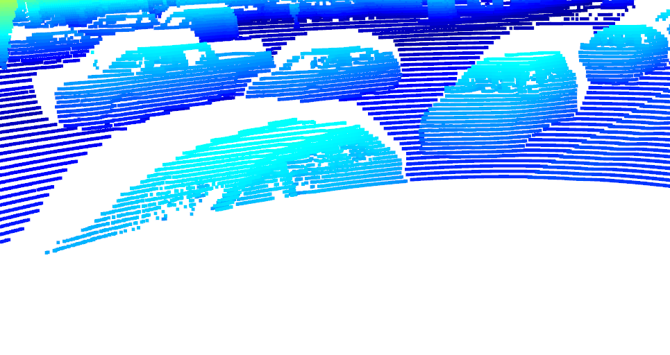

__Note: I have completed the tasks as described in "Project Instructions Steps" 1 through 4. I noticed that the program doesn't include instructions nor does the Udacity page to complete the density bev map even though the other functions require all three bev maps: range, intensity, and density. I am not sure if I need to complete this part of the program. Also, in the rubric there is a "Crop range image to +/- 90 degree" but the program includes no instruction to complete this part. Again, I am not sure if I needed to do this step. If there is a review before final submission, please let me know what steps I need to fix, and what I need to add if anything. Thank you__

# 3D Object Detection Project Writeup
## Varying visibility examples

This car is behind the car equipped with lidar and the front and right sides can be seen.

Here, the car closest to the LiDAR has its rear and side visible while cars further away only have their back sides visible.

Here, a car far away facing the LiDAR is barely visible in the point-cloud.

A car perpendicular to the car equipped with LiDAR has its left side visible while the top doesn't feature any points in the point-cloud

Here, the trailer's back and the truck's rear are both visible since they are at an angle from the LiDAR

Since a car is too close to the LiDAR, the bottom of the car can't be detected in the point-cloud

## Stable Feature examples

As can bee seen from the intensity-range images, the head-lights, tail-lights, license plates, sometimes wheel rims are stable features depending on the orientation of the vehicle. If a scene has direct sunlight reflected off of the rear's of vehicles the stable features are even more well pronounced.